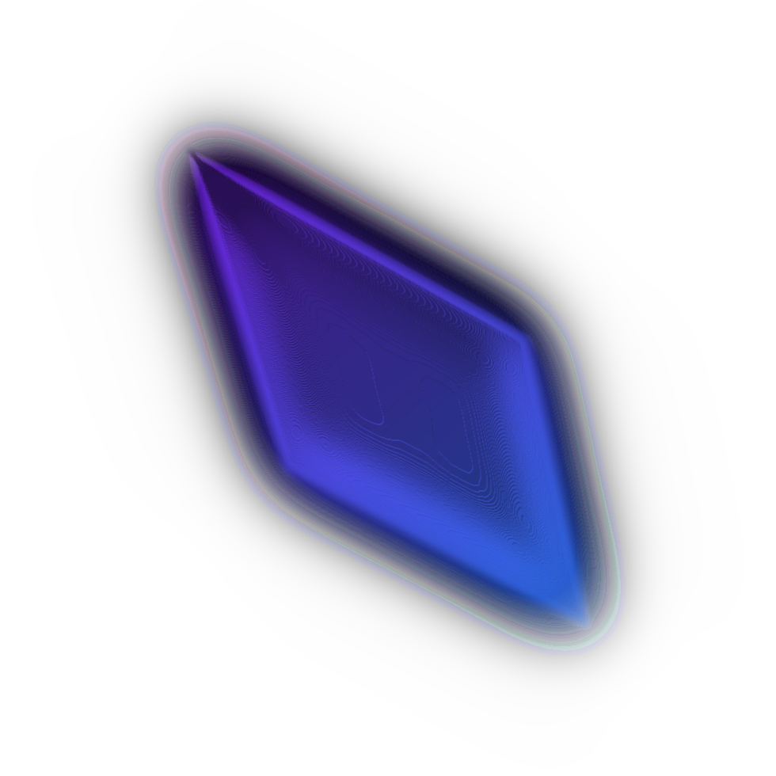

    

<h2 align="center"><b>CSSPlan</b></h2>

### About

`CSSPlan` gives an option to quickly configure CSS inside a web browser for your custom HTML. Using JavaScript.

#### Run

Runtime is available under <a href="editor.html"><i>editor</i></a>. Doesn't require backend to work rather than a HTTP server to serve content.

#### License

**GPL 3.0**

#### Copyright

**Copyright 2023 Chimmie Firefly**
